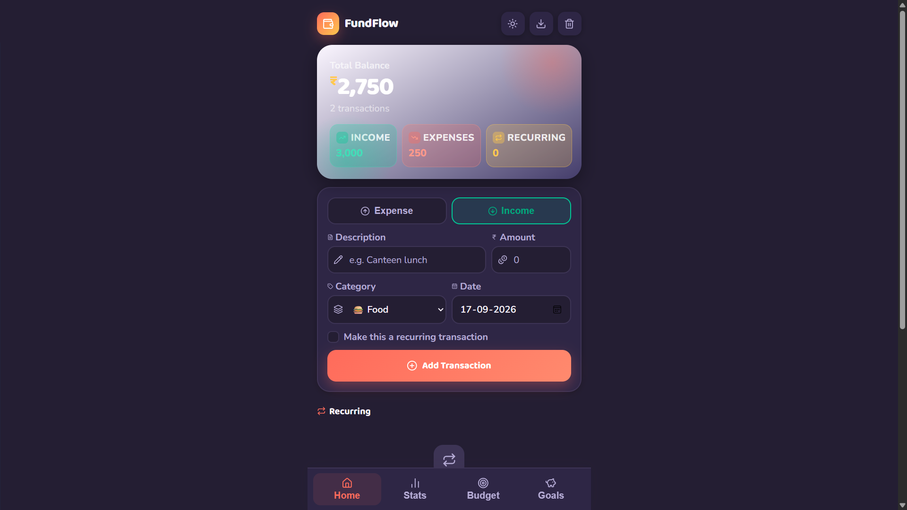
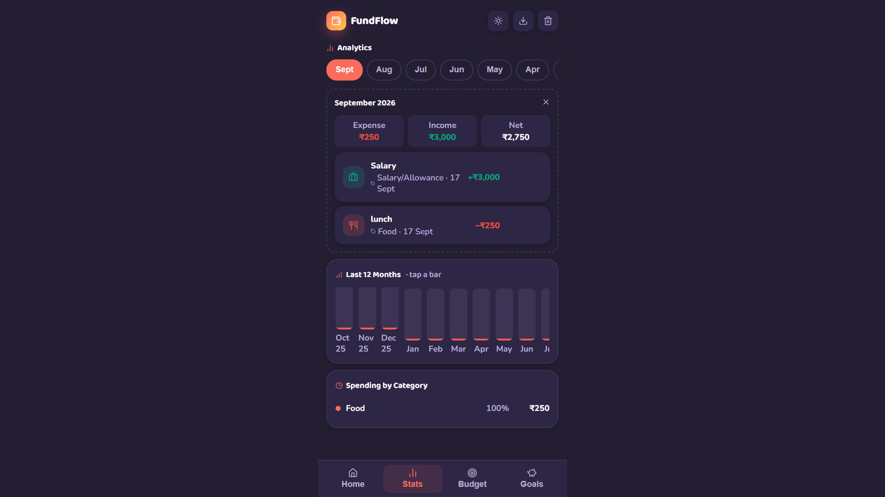
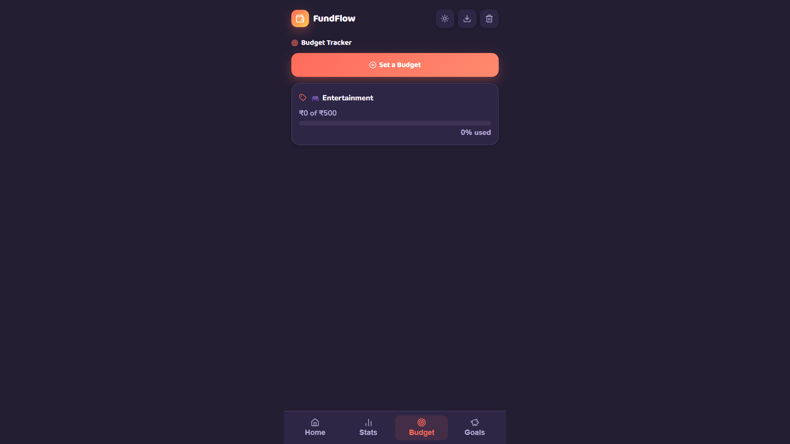
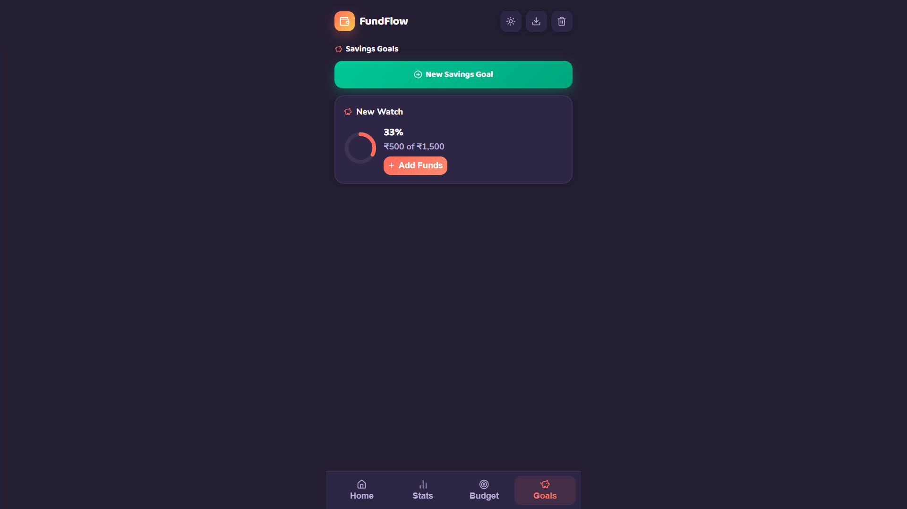

# 💸 FundFlow — Student Expense Tracker

<div align="center">


**A colorful, student-friendly expense tracker with budgets, recurring transactions & savings goals — built as a Progressive Web App.**

[](#)
[](LICENSE)

</div>

---

## ✨ Features

| Feature | Description |
|---|---|
| 💰 **Transaction Tracking** | Add income & expense with categories, description & date |
| 🔁 **Recurring Transactions** | Auto-add monthly/weekly entries like rent, allowance, or subscriptions |
| 🐷 **Savings Goals** | Set a target (e.g. "New Laptop"), track progress with a ring chart, top up anytime |
| 📊 **12-Month Analytics** | Rolling year bar chart + category-wise spending breakdown |
| 🎯 **Budget Tracker** | Set monthly or custom date range budgets per category |
| 🗑️ **Clear Records** | Delete transactions by month, range, or all at once |
| ✏️ **Edit Transactions** | Fix a mistyped amount or category without deleting and re-adding |
| 📤 **CSV Export** | Download all transactions as a spreadsheet-ready CSV |
| 🌙 **Dark / Light Mode** | Smooth theme toggle — preference saved automatically |
| 📱 **Fully Responsive** | Optimized for both mobile and desktop |
| 📲 **PWA Installable** | Install as a native app on Android & iOS |
| 🔒 **100% Private** | All data stored locally — no server, no account needed |
| ⚡ **Offline Support** | Works without internet after first load |

---

## 📸 Screenshots

> Add a `screenshots/` folder to the repo with these images, then these paths will render automatically on GitHub.

| Home | Analytics |
|---|---|
|  |  |

| Budget | Goals |
|---|---|
|  |  |

---

## 🛠️ Tech Stack

- **HTML5** — Semantic structure
- **Vanilla CSS3** — CSS variables, grid, animations, responsive design
- **Vanilla JavaScript** — No frameworks, pure JS logic
- **Lucide Icons** — Beautiful open-source icon library
- **localStorage** — Client-side data persistence
- **Service Worker** — Offline caching & PWA support

---

## 🚀 Getting Started

### Option 1 — Open directly
```bash
# Just open in browser
open index.html
```

### Option 2 — Local server (for PWA features)
```bash
# Using Python
python -m http.server 8000

# Using Node.js
npx serve .

# Using VS Code
# Install "Live Server" extension → Right click index.html → Open with Live Server
```
Then open: `http://localhost:8000`

---

## 📂 File Structure

```
fundflow/
├── index.html       # App shell — layout & styles
├── app.js           # App logic — transactions, budgets, goals, analytics
├── manifest.json     # PWA manifest — icons, theme, display mode
├── sw.js             # Service Worker — offline caching
├── icon-192.png       # App icon (192×192)
├── icon-512.png       # App icon (512×512)
└── README.md          # This file
```

---

## 📲 Install as App (PWA)

> Requires the app to be served over `http://` or `https://` (see **Option 2** above) — installing directly from a `file://` path opened by double-click won't show the install prompt.

### Android (Chrome)
1. Open the app URL in **Chrome**
2. Tap **⋮ Menu** → **"Add to Home Screen"**
3. Tap **"Install"** → App installed! ✅

### iPhone / iPad (Safari)
1. Open the app URL in **Safari**
2. Tap **Share ⬆** button
3. Tap **"Add to Home Screen"**
4. Tap **"Add"** → App installed! ✅

---

## 💡 Usage Guide

### Adding a Transaction
1. Select **Expense** or **Income** tab
2. Enter **Amount** (required)
3. Enter **Description** *(optional — auto-fills from category)*
4. Choose **Category**
5. Select **Date**
6. If category is "Other" → enter custom name
7. Optionally tick **"Make this a recurring transaction"** and choose weekly/monthly
8. Tap **"Add Transaction"**

### Setting a Budget
1. Go to the **Budget** tab → tap **"Set a Budget"**
2. Select **Category**
3. Choose **Period**:
   - 📅 **Monthly** — tracks current month spending
   - 📆 **Custom** — set your own start & end date
4. Enter **Budget Limit**
5. Tap **Save** — budget tracker shows real-time progress

### Creating a Savings Goal
1. Go to the **Goals** tab → tap **"New Savings Goal"**
2. Enter a **Goal Name**, **Target Amount**, and any amount **already saved**
3. Tap **Save** — a progress ring shows how close you are
4. Tap **"Add Funds"** anytime to top it up

### Clearing Records
1. Tap 🗑️ **trash icon** in header
2. Choose what to clear:
   - This Month
   - Last 3 / 6 Months
   - This Year
   - Custom Date Range
   - ALL Records
3. Preview shows how many transactions will be deleted
4. Confirm → Done ✅

### Analytics
- Go to the **Stats** tab
- Scroll the **12-month bar chart** and tap any bar to drill into that month
- Tap a **month pill** to see that month's income, expenses & net
- See spending breakdown by category below the chart

---

## 🔒 Data & Privacy

```
Your Data Flow:
Phone/PC Browser → localStorage → Stays on YOUR device

❌ No server
❌ No database  
❌ No account required
❌ No data sent anywhere
✅ 100% private
✅ Works offline
```

> ⚠️ **Note:** Clearing browser cache or site data will erase your transactions.
> Use the **Export CSV** button in the header to keep a backup.

---

## 🔄 Deployment (optional — e.g. Netlify)

### One-time GitHub Setup
```bash
git init
git add .
git commit -m "Initial commit"
git remote add origin https://github.com/amansindhi/FundFlow.git
git push -u origin main
```

### Connect to Netlify
1. Go to [app.netlify.com](https://app.netlify.com)
2. **"Add new site"** → **"Import from GitHub"**
3. Select **FundFlow** repo
4. Deploy! ✅

### Auto-Deploy
Every `git push` → Netlify automatically deploys! 🚀

```bash
# Update workflow
git add .
git commit -m "v1.1 - Added savings goals"
git push
# → Live in ~30 seconds!
```

---

## 🗺️ Roadmap

- [ ] Import data (backup restore)
- [ ] Multiple currencies
- [ ] Custom categories
- [ ] Widgets / home screen summary
- [ ] Shared/group expenses

---

## 👨‍💻 Developers

**Built by** — *Aman Sindhi*

[](https://github.com/amansindhi)

---

## 📄 License

This project is for **personal use and portfolio** purposes.
Feel free to fork and modify for your own use.

---

<div align="center">
Made with ❤️ | No subscriptions. No ads. Just your money.
</div>
